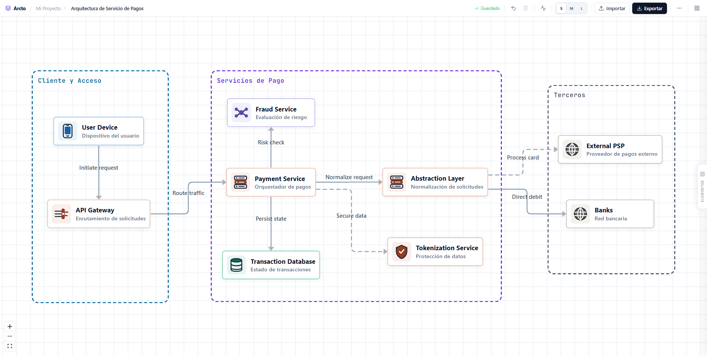

# Arcto — Architecture Diagrams

> Herramienta web open source para diseñar diagramas de arquitectura de software de forma visual e interactiva.

[](LICENSE)
[](https://react.dev)
[](https://www.typescriptlang.org)
[](https://vitejs.dev)

**[🚀 Pruébalo en vivo →](https://franklinruiz.github.io/arcto/)**



---

## ¿Qué es Arcto?

Arcto es un editor de diagramas de arquitectura que corre completamente en el navegador — sin backend, sin cuenta, sin instalación. Diseña la arquitectura de tu sistema arrastrando componentes al lienzo, conectándolos y exportando el resultado como JSON para compartirlo con tu equipo.

---

## Características

### Paleta de elementos
45 componentes organizados en 9 grupos que cubren los bloques de una arquitectura moderna, de punta a punta:

| Grupo | Elementos |
|---|---|
| Actores | Usuario, Sistema Externo |
| Presentación | Frontend Web, App Móvil |
| Servicios | API Gateway, Microservicio, Worker / Job |
| Datos | Base de Datos, Caché, Message Queue, Vector DB |
| Infraestructura | Cloud, On-Premise, Mainframe, Kubernetes, Contenedor, Load Balancer, CDN, Object Storage, File Storage |
| Integración | Event Bus, Pub/Sub, Webhook, ETL, Service Mesh |
| Observabilidad | Logging, Métricas, Monitoring, Tracing, Alerting |
| Seguridad | WAF, IAM, OAuth2, Key Vault, Secrets, API Security |
| Inteligencia Artificial | AI Model, AI Agent, MCP Server, AI Tool, Prompt Template, Knowledge Base, RAG Pipeline, Guardrails, AI Workflow |

Además: **contenedores de dominio** (para agrupar y delimitar zonas/capas del diagrama) y **anotaciones** (texto libre, etiquetas).

### Lienzo interactivo
- Arrastrar y soltar elementos desde la paleta
- **16 puntos de conexión** por nodo, visibles al pasar el cursor con animación
- Conexiones `smoothstep` con etiqueta editable — el protocolo se **sugiere automáticamente** según el tipo de nodo origen/destino (p. ej. Backend → Base de Datos sugiere `JDBC`) y siempre es editable con doble clic
- Selección con un clic: abre el panel de propiedades del nodo o conexión en el sidebar
- **Contenedores redimensionables desde cualquier borde** (no solo las esquinas), con alineación de título configurable (izquierda / centro / derecha)
- **Modo presentación**: al activarlo, hacer clic en un nodo anima el flujo de datos hacia sus conexiones y resalta con un pulso ("faro") los nodos relacionados — ideal para demos
- **Selección múltiple por lazo** (arrastrar sobre el canvas)
- **Paneo** con clic derecho + arrastrar
- Controles de zoom y fondo de cuadrícula

### Texto libre
- Nodos de anotación editables directamente en el lienzo
- Formato: negrita, cursiva, subrayado, tamaño (12–32 px) y 8 colores
- Panel de formato en el sidebar al seleccionar el nodo

### Edición
- Panel de propiedades en el sidebar: nombre, subtítulo, tipo de componente con icono en tiempo real
- Edición inline del texto de las conexiones con doble clic
- `Enter` para guardar · `Escape` para cancelar

### Persistencia y historial
- **Guardado automático** en `localStorage` — el diagrama sobrevive a recargas
- **Deshacer** con `Ctrl+Z` / `Cmd+Z` — hasta 60 pasos
- **Importar / Exportar JSON** para compartir o hacer backup

### Barra de herramientas
- Contraer / expandir sidebar
- Eliminar selección (`Supr`)
- Limpiar lienzo
- Importar y exportar diagrama

---

## Stack

| | |
|---|---|
| UI | React 19 + TypeScript |
| Build | Vite |
| Diagramas | @xyflow/react v12 |
| Tests | Vitest |
| Estilos | CSS puro (sin Tailwind ni librerías de iconos externas) |

---

## Desarrollo local

```bash
# 1. Clona el repositorio
git clone https://github.com/franklinruiz/arcto.git
cd arcto

# 2. Instala dependencias
npm install

# 3. Inicia el servidor de desarrollo
npm run dev
```

Otros comandos:

```bash
npm run build     # build de producción
npm run preview   # previsualiza el build localmente
npm test          # ejecuta la suite de pruebas
npm run test:watch  # modo watch
```

---

## Estructura del proyecto

```
src/
├── app/
│   └── App.tsx
├── features/
│   └── diagram-builder/
│       ├── components/
│       │   ├── icons/DiagramIcons.tsx   # todos los SVG del proyecto
│       │   ├── AnnotationNode.tsx
│       │   ├── AppToolbar.tsx
│       │   ├── DiagramCanvas.tsx
│       │   ├── EdgeEditContext.ts
│       │   ├── GroupNode.tsx            # contenedores de dominio
│       │   ├── IconNode.tsx
│       │   ├── InlineEditableEdge.tsx   # conexiones + edición inline
│       │   ├── LabelNode.tsx
│       │   ├── LibraryPanel.tsx         # paleta de elementos
│       │   ├── PalettePanel.tsx         # panel de propiedades (sidebar)
│       │   ├── Sidebar.tsx
│       │   ├── SoftwareNode.tsx
│       │   └── TextNode.tsx
│       ├── constants/diagram.constants.ts
│       ├── hooks/useDiagramBuilder.ts   # lógica central del editor
│       ├── pages/DiagramBuilderPage.tsx
│       ├── types/diagram.types.ts
│       ├── utils/
│       │   ├── diagramFactory.ts        # creación de nodos/edges + inferencia de protocolo
│       │   └── diagramValidation.ts
│       └── __tests__/
│           ├── diagramFactory.test.ts
│           └── diagramValidation.test.ts
└── styles/index.css
```

---

## Contribuir

¡Las contribuciones son bienvenidas! Si quieres mejorar Arcto, aquí tienes cómo hacerlo:

### Reportar un bug o sugerir una mejora

1. Revisa los [issues existentes](https://github.com/franklinruiz/arcto/issues) para evitar duplicados.
2. Abre un nuevo issue describiendo:
   - **Bug:** qué ocurrió, qué esperabas que ocurriera y pasos para reproducirlo.
   - **Mejora:** qué problema resuelve y cómo lo imaginas.

### Enviar un Pull Request

1. Haz un fork del repositorio y crea tu rama desde `main`:
   ```bash
   git checkout -b feat/nombre-de-tu-feature
   ```
2. Realiza tus cambios siguiendo las convenciones del proyecto (TypeScript estricto, CSS puro, sin dependencias innecesarias).
3. Asegúrate de que los tests pasen:
   ```bash
   npm test
   ```
4. Abre un Pull Request hacia `main` con una descripción clara de los cambios y el problema que resuelven.

### Guías de estilo

- **TypeScript:** tipos explícitos, sin `any`.
- **Componentes:** funcionales con hooks; lógica de estado en `useDiagramBuilder`.
- **CSS:** clases BEM-like (`.bloque__elemento--modificador`); sin frameworks de utilidades.
- **Commits:** mensajes en imperativo, en inglés o español, ej. `feat: add export to PNG`.

---

## Licencia

Distribuido bajo la licencia **MIT**. Consulta el archivo [LICENSE](LICENSE) para más detalles.

---

## Autor

Hecho con ❤️ por [Franklin Ruiz](https://github.com/franklinruiz).  
¿Tienes alguna pregunta? Abre un [issue](https://github.com/franklinruiz/arcto/issues) o escríbeme directamente.
